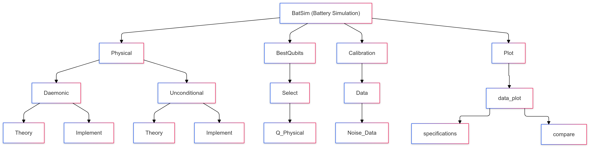

Certainly! Here's a `README.md` file based on your explanations:

```markdown
# BatSim: Battery Simulation Package

## Overview

In this notebook, we aim to provide the necessary code for producing the plots shown in our paper. To simplify the code, we have packaged all the necessary functions into a package called "BatSim," which stands for Battery Simulation. This package consists of different parts, as illustrated below.

## Package Structure

The BatSim package is composed of five main sub-packages:

### 1. Physical
This sub-package is based on a model that provides the charging of the quantum battery (QB) and correlates it with an ancilla using the unitary gate generated from the Hamiltonian.

### 2. RyCnot
This sub-package uses Ry rotation for charging the QB and a CNOT gate for correlating with the ancilla. Both Physical and RyCnot sub-packages have a similar structure:
- **Daemonic**: Responsible for Daemonic work extraction.
- **Unconditional**: Responsible for unconditional work extraction.
- **Theory**: Contains codes needed for theoretical results.
- **Implement**: Contains codes for implementation results on real hardware.

### 3. BestQubits
This sub-package is designed for finding the best qubits in terms of low readout error to maximize the power of IBM devices and enhance the results. It includes:
- **Select**: Module with two attributes:
  - **Q_RyCnot**: Selects the best qubits based on the RyCnot model.
  - **Q_Physical**: Selects the best qubits based on the Physical model.

### 4. Calibration
This sub-package includes:
- **Data**: Module with one attribute:
  - **Noise_Data**: Obtains the parameters needed for engineering our proposed noise model to mimic hardware behavior in theoretical calculations and find the best optimal unitary gates.

### 5. Plot
This sub-package is designed for plotting the results in two modes: noisy and ideal. It includes:
- **data_plot**: Module with two attributes:
  - **specifications**: For single plotting.
  - **compare**: For comparison plotting.

## Installation

To install the BatSim package, clone the repository and install the required dependencies:

```bash
git clone https://github.com/your-repo/BatSim.git
cd BatSim
pip install -r requirements.txt
```

## Usage

### Setting Parameters

In your notebook, you can set the parameters for running the code as follows:

```python
Steps = 10
Charge = 6 * pi / 10
omega = 1
kappa = 1
shots = 10000
```

### Backend Selection

Choose the backend for running your circuits and find the best qubits:

```python
service = QiskitRuntimeService(channel="ibm_quantum")
backend = service.get_backend('ibm_osaka')
properties = backend.properties()
qubits = Select.Q_Physical(Steps=Steps, omega=omega, kappa=kappa, backend=backend)
qubits = qubits[0]
backend_data = properties.to_dict()
```

### Noise Parameters Calculation

Obtain noise parameters from the Data module:

```python
P01, P10, pa, pd = Data.Noise_Data(backend=backend, shots=shots, qubits=qubits, simulator=True)

# If running on a simulator, uncomment the following line
# backend = AerSimulator().from_backend(backend)
```

### Daemonic and Unconditional Model Execution

Calculate theoretical and implemented results using the Daemonic and Unconditional modules:

```python
Passive_Theory = Daemonic.Theory(Steps=Steps, Charge=Charge, pa=pa, pd=pd, P01=P01, P10=P10)
Passive_Im = Daemonic.Implement(Steps=Steps, Charge=Charge, backend=backend, shots=shots, qubits=qubits)

Energy_Theory, Ergotropy_Theory = Unconditional.Theory(Steps=Steps, Charge=Charge, pa=pa, pd=pd)
Energy_Im, Ergotropy_Im = Unconditional.Implement(Steps=Steps, Charge=Charge, backend=backend, shots=shots, qubits=qubits)

Daemonic_Theory = [xi - yi for xi, yi in zip(Energy_Theory, Passive_Theory)]
Daemonic_Im = [xi - yi for xi, yi in zip(Energy_Im, Passive_Im)]
```

### Plotting Results

Generate specific plots using the data_plot module:

```python
# Noisy case
data_plot.specefications(Ergotropy_Theory=Ergotropy_Theory, 
                         Ergotropy_Im=Ergotropy_Im, 
                         Daemonic_Theory=Daemonic_Theory, 
                         Daemonic_Im=Daemonic_Im, 
                         legend=True, 
                         file_name="Noisy")

# Ideal case
data_plot.specefications(Ergotropy_Theory=Ergotropy_TheoryIdeal, 
                         Ergotropy_Im=Ergotropy_ImIdeal, 
                         Daemonic_Theory=Daemonic_TheoryIdeal, 
                         Daemonic_Im=Daemonic_ImIdeal, 
                         legend=True, 
                         file_name="Ideal")

# Comparison plot
data_plot.compare(Ergotropy_Theory=Ergotropy_Theory, 
                  Ergotropy_TheoryIdeal=Ergotropy_TheoryIdeal, 
                  Ergotropy_Im=Ergotropy_Im, 
                  Ergotropy_ImIdeal=Ergotropy_ImIdeal,
                  Daemonic_Theory=Daemonic_Theory,  
                  Daemonic_TheoryIdeal=Daemonic_TheoryIdeal, 
                  Daemonic_Im=Daemonic_Im, 
                  Daemonic_ImIdeal=Daemonic_ImIdeal, 
                  legend=True, 
                  file_name="compare")
```

## License

This project is licensed under the MIT License - see the [LICENSE](LICENSE) file for details.

## Acknowledgments

We would like to thank the contributors and the community for their support and contributions to this project.

```

This `README.md` file provides a comprehensive overview of your BatSim package, including installation, usage, and explanations of its structure and components. Adjust the content as needed to match your project's specific details and requirements.
